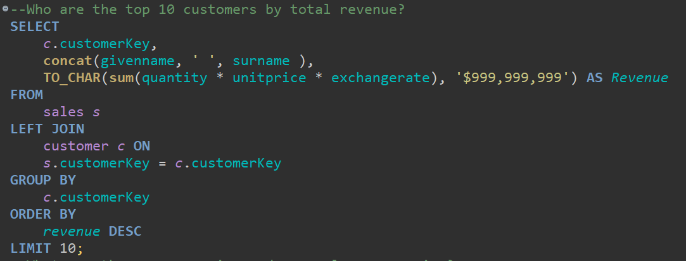

# 🧠 SQL Portfolio Project – Easy Level Analysis  
**Dataset**: Contoso_100k  
**Tool Used**: SQL  
**Project Level**: Easy  
**Focus**: Business Insights & Decision Support

## 📊 Overview  
This project is part of a comprehensive SQL-based portfolio aimed at extracting actionable insights from the **Contoso_100k** dataset, a fictional retail data model widely used in business analytics. The **Easy Level** focuses on answering foundational business questions that can guide sales strategy, customer targeting, and regional performance evaluation.

## 🎯 Business Questions Answered  

1. **What are the total sales per month?**  
   - **Business Value**: Identifies seasonality and monthly performance trends to support decisions related to inventory planning, promotions, and budgeting.
   - **Insight**: Helps management allocate resources effectively and anticipate high- and low-sales periods.
   
    
     
2. **Which product categories generate the most revenue?**  
   - **Business Value**: Highlights which categories contribute most to revenue, enabling focused marketing, bundling strategies, and investment in high-performing segments.
   - **Insight**: Supports product line optimization and sales prioritization.
   

     
3. **Who are the top 10 customers by total revenue?**  
   - **Business Value**: Enables personalized relationship management with high-value clients and informs retention strategies.
   - **Insight**: Aids in loyalty program design and sales team prioritization.
   

     
4. **What are the average, min, and max sales per region?**  
   - **Business Value**: Provides a snapshot of regional performance, helping to identify strong markets and underperforming areas.
   - **Insight**: Useful for geo-targeted campaigns, logistics planning, and regional management performance reviews.
   

     
## 📌 Key Takeaways
- SQL is a powerful tool to answer core business questions quickly and efficiently.
- Even basic queries can reveal high-impact insights when aligned with business objectives.
- These foundational analyses set the stage for deeper investigation in the medium and hard levels of this project.

