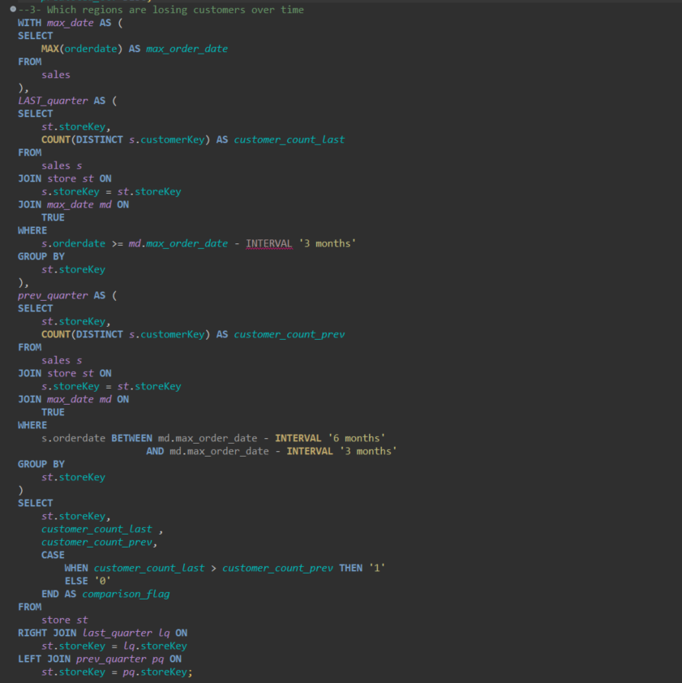

# 🔍 SQL Portfolio Project – Hard Level Analysis  
**Dataset**: Contoso_100k  
**Tool Used**: SQL  
**Project Level**: Hard  
**Focus**: Customer Lifetime Value, Product Preference Modeling, Regional Churn Analysis

## 📊 Overview  
The Hard Level of this SQL project moves into advanced analytics that directly support long-term business strategy. These queries simulate KPIs used by C-level decision-makers to optimize revenue, reduce churn, and personalize customer experiences. This level combines multiple SQL techniques such as **ranking functions**, **correlated subqueries**, **aggregations**, and **time-based analysis**.

## 🎯 Business Questions Answered  

1. **What are the top 3 products per customer by total spend?**  
   - 📌 **Skills Used**: `RANK()` window function, CTEs, aggregations  
   - 🧠 **Business Use**: Enables hyper-personalized marketing and product recommendations. Understanding individual buying preferences boosts upselling, cross-selling, and product bundling strategies.
   

2. **What is each customer’s Lifetime Value (LTV)?**  
   - 📌 **Skills Used**: Aggregation over time, customer-level metrics  
   - 🧠 **Business Use**: Core metric for strategic planning in customer acquisition and retention. Businesses use LTV to define budget allocation for marketing, loyalty programs, and profitability forecasting.
    
3. **Which regions are losing customers over time?**  
   - 📌 **Skills Used**: Time-based analysis, trend evaluation  
   - 🧠 **Business Use**: Early detection of market churn helps reduce revenue loss. Identifying declining regions allows for timely interventions through re-engagement campaigns or operational audits.
   

## 🧠 Strategic Value
- Insights at this level are used for **long-term decision-making**, not just day-to-day operations.
- Organizations can simulate **real-world business KPIs** using SQL alone—no dashboards or advanced BI tools required.
- This level highlights the power of data-driven thinking in identifying opportunities and preventing losses before they occur.

## ✅ Conclusion
This final stage demonstrates how SQL is not just a technical skill but a **business intelligence weapon** when used properly. The ability to extract strategic insights directly from raw data puts analysts in a powerful position to guide business growth.

---
