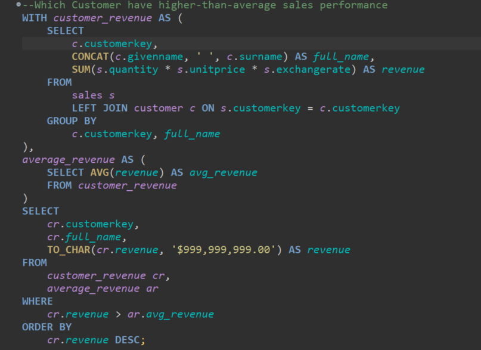
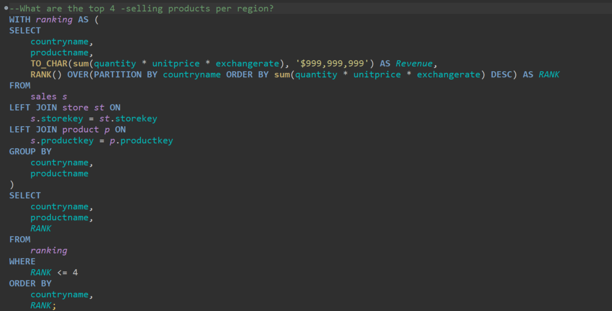

# 📈 SQL Portfolio Project – Medium Level Analysis  
**Dataset**: Contoso_100k  
**Tool Used**: SQL  
**Project Level**: Medium  
**Focus**: Customer Loyalty, Sales Strategy, Employee Performance, Revenue Trends

## 📊 Overview  
The Medium Level dives deeper into the dataset to extract insights that support strategic decision-making. This stage utilizes more advanced SQL techniques such as **CTEs**, **window functions**, and **nested queries** to analyze behavior, performance, and trends that directly impact growth, retention, and operational efficiency.

## 🎯 Business Questions Answered  

1. **Who are the repeat customers with the highest average order value?**  
   - 📌 **Skills Used**: Subquery or CTE with aggregation  
   - 🧠 **Business Use**: Identifies loyal, high-spending customers for loyalty programs, exclusive offers, or white-glove service strategies.
   

2. **What are the top-selling products per region?**  
   - 📌 **Skills Used**: CTE + `RANK()` window function  
   - 🧠 **Business Use**: Helps regional managers focus on products that resonate most with local customers. Enables tailored inventory and promotional strategies per location.
   

3. **What is the monthly growth in revenue (MoM %)?**  
   - 📌 **Skills Used**: CTE + `LAG()` + revenue change calculation  
   - 🧠 **Business Use**: Tracks business momentum. Supports executive decisions on scaling, investment, and identifying early warning signs of downturns.
    
## 💼 Key Business Insights
- Advanced SQL techniques empower deeper pattern recognition and operational diagnosis.
- Insights extracted at this level help bridge tactical execution with strategic business decisions.
- Organizations can shift from reactive management to proactive optimization using trend and performance analysis.

---
